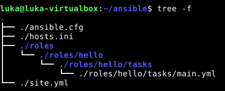
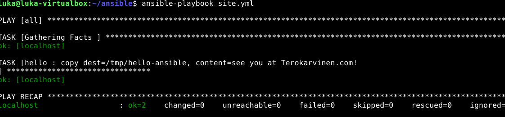

# Heei ansiblen maailma

## Tiivistelmät

### SSH public key
- Asennetaan ssh komennolla sudo apt-get -y install ssh. -y = vastaa kaikkiin asennuksen aikana tuleviin kysymyksiin yes automaattisesti. 
- Avain pariluodaan komennolla ssh-keygen
- Julkinen avain kopioidaan komenolla ssh-copy-id localhost authorized_keys hakemistoon mikä automatisoi ssh kirjautumisen. 

### Hello Ansible
- Ansible käyttää SSH:ta (ei agenttia), vaatii vain SSH + Python kohde koneella
- Luo hosts.ini (inventaario) ja testaa komennolla: ansible all -a "uptime"
- Poista Python-varoitus lisäämällä: ansible_python_interpreter=/usr/bin/python3
- Helpota käyttöä: määritä ansible.cfg → inventory = hosts.ini
- Playbook (site.yml) määrittää mitä rooleja ajetaan mille koneille
- Roolit sijaitsevat roles/-kansiossa, esim. tasks/main.yml sisältää tehtävät
- YAML vaatii välilyönnit (ei tabit) ja oikean sisennyksen
---
### a) Sshecrets. Asenna SSH-demoni ja testaa se kirjautumalla SSH:lla.
Asensin ssh serverin komennolla **sudo apt install openssh-server** jonka jälkeen käynnistin sen komennolla **sudo systemctl enable --now ssh.** Kirjauduin sitten sisään komennolla **ssh localhost.**
---
### b) Pubkey. Automatisoi ssh-kirjautuminen julkisella avaimella.
Seuraavaksi loin avaimen komennolla **ssh-keygen** ja painoin kolme kertaa enter. Sitten kopioin julkisen avaimen komennolla **ssh-copy-id localhost** tämän jälkeen kirjautuminen oli automatisoitu
---
### c) Hei Ansible. Tee hei maailma ansiblella ja kokeile sitä SSH:n yli.
Tässä lopputulokset 

---

