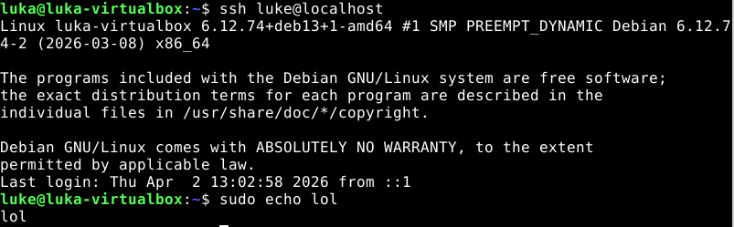
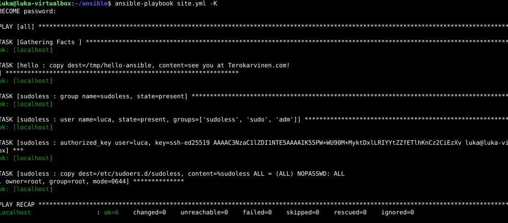
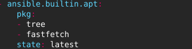
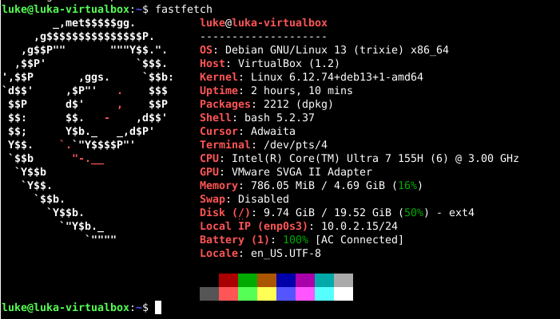
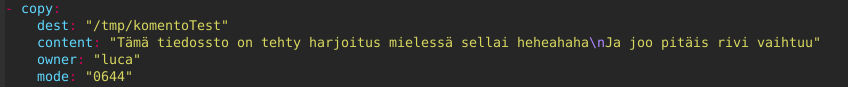
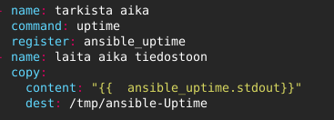

# H2 Voileipä

## Sudo without password
- **Komento sudo \-i** toisessa ikkunassa varotoimena kun räplätään sudon kanssa.  
- cat /etc/sudoers.d/sudoless ---> %sudoless ALL = (ALL) NOPASSWD: ALL

## xkcd 149: Sandwitch
- sudo = Taikasana 

## Passwordless Sudo with Ansible
- Aina manuaalina ennen automatisointia  
- -K parametri = become-password.

## Ansible-doc

**copy** Kopioi tiedostoja ohjauskoneelta kohdekoneelle tai luo sisältöä suoraan kohteeseen.

content – kirjoittaa annetun tekstisisällön suoraan tiedostoon

src – lähdetiedosto ohjauskoneella

dest – kohdepolku kohdekoneella

owner – tiedoston omistaja

group – tiedoston ryhmä

mode – käyttöoikeudet (esim. 0644)

---
**apt** Hallinnoi paketteja.

Name – paketin nimi

state – tila (present, absent, latest)

update_cache – päivittää pakettivaraston (true/false)

---
**file** Hallinnoi tiedostojen, hakemistojen ja linkkien olemassaoloa ja ominaisuuksia.

path – kohteen polku

state – tila (file, directory, absent, link)

src – linkin lähde (symbolisille linkeille)

recurse – asettaa ominaisuudet rekursiivisesti

owner – omistaja

group – ryhmä

mode – oikeudet

---
**user** Hallinnoi käyttäjätilejä kohdejärjestelmässä.

name – käyttäjän nimi

state – present/absent

create_home – luodaanko kotihakemisto

comment – käyttäjän kuvaus

groups – ryhmät joihin käyttäjä kuuluu

shell – oletusshell

system – onko järjestelmäkäyttäjä (true/false)

---
**authorized_key** Lisää tai poistaa SSH-avaimia käyttäjän authorized_keys-tiedostosta.

user – käyttäjä, jolle avain lisätään

key – julkinen SSH-avain

## Tehtävät
 
a) Ensimmäisenä loin käyttäjän komennolla **sudo adduser**. Sitten loin ryhmän sudoless komennolla sudo **groupadd sudoless** jonka jälkeen lisäsin uuden käyttäjän luke tähän ryhmään komennolla **sudo adduser luke sudoless**. Tämän jälkeen menin /etc/sudoers.d/sudoless visudo editorilla jossa lisäsin  **%sudoless ALL = (ALL) NOPASSWD: ALL** säännön sudoless ryhmälle mikä sallii sudon käytön ilman salasanaa.
 

 ---
b) Seuraavaksi tein saman ansiblella tekemällä uuden roolin **sudoless** ja lisäämällä roolille kuvassa näkyvät tehtävät. Ajoin sitten main.yml -K parametrillä.  

 
 
 

 ---
c) Seuraavaksi asensin kaksi pakettia ansiblella fastfetch ja tree.

Molemmat asentuivat ilman ongelmia tässä fastfetchistä kuva.   

---
d) Seuraavaksi tein tiedoston jossa on jotain tekstiä ja rivijako **\n**.

Tiedoston oikeuden menevät seuraavanlaisesti: Tiedoston omistaja eli luca saa lukea ja kirjoittaa. ryhmä saa lukea ja muut saavat lukea.  

---
e) Viimeisenä käytin kahta komentoa joita mielestäni kurssilla ei vielä ole käytetty **Register** ja **Command**. Command kohtaan voi syöttää linuxin perus komentoja kuten “uptime”. Register tallentaa tulokset mitkä sijoitetaan tiedostoon.

  
 

## Lähteet 
Tero Karvinen Sudo without password. Luettavissa: https://terokarvinen.com/passwordless-sudo/ Luettu 7.4.2026

Munroe Sandwich. Luettavissa: https://xkcd.com/149/ Luettu 7.4.2026

Tero Karvinen Passwordless Sudo with Ansible. Luettavissa: https://terokarvinen.com/passwordless-sudo-with-ansible/ Luettu: 7.4.2026

Harsh Mishra Ansible Tasks: Complete guide for Beginners. Luettavissa: https://dev.to/harshm03/ansible-tasks-complete-guide-for-beginners-2gn3 Luettu: 7.4.2026
