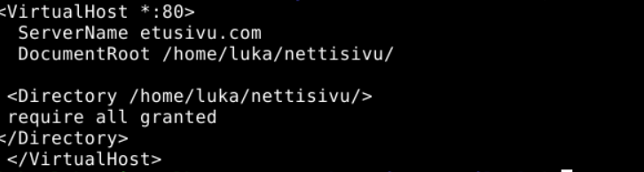
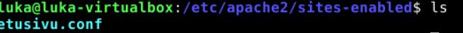
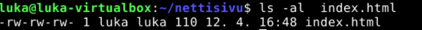
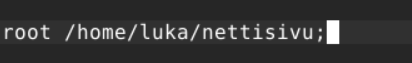
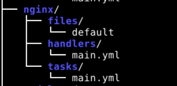
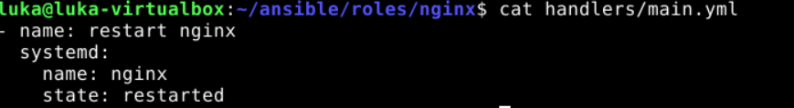
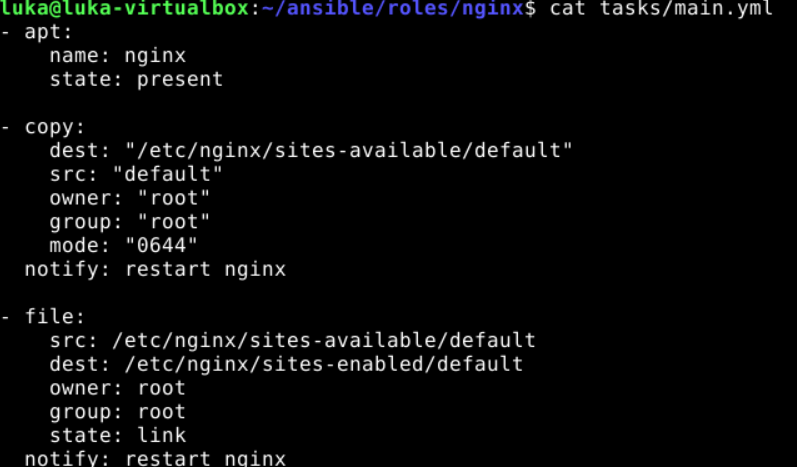

## Tehtävät

a) Aloitin tehtävän asentamalla apachen komennolla sudo apt install apache2. Sitten loin uuden tiedoston johon haluan sijoittaa nettisivun /home/luka/nettisivu/. 
Seuraavaksi menin /etc/apache2/sites-avaible/ ja loin tiedoston etusivu.conf ja laitoin sinne kuvassa näkyvän sisällön.

Tämän jälkeen loin symbolisen linkin /etc/apache2/sites-avaible/rtusivu.conf --> /etc/apache2/sites-enabled/

 

Sitten lisäsin vielä tiedostoille /home/luka/ ajo-oikeudet, /home/luka/nettisivu/ ajo-oikeudet ja /home/luka/nettisivu/index.html kirjoitus ja luku oikeudet kaikille muille kohtiin. 

 

Tämän jälkeen pääsin sivulle ja muut käyttäjät pystyvät muokkaamaan sivua ilman sudoa. 

---
b) Seuraavaksi asensin nginxin saman lailla. Ainoana erona oli että minun täytyi mennä /etc/ngixn/sites-avaible/default ja muutin sieltä document rootin kotihakemistoon. 

 

Tämän jälkeen käynnistin nginxin uudelleen ja netti sivu toimi. Käytin samaa index.html tiedostoa minkä olin tehnyt apachea varten. Sammutin vain apachen niin kaikki sujui hyvin.

---
c) Viimeisenä aloitin tekemällä kansiot ja tiedostot valmiiksi. 

 

Kopioin /files/ default config tiedoston mikä toimi kun tein tämän manuaalisesti. Handlers main.yml tiedoston täytin seuraavanlaisesti 

 

ja tasks main.yml 

 

Kun suoritin playbookin kaikki meni läpi ilman ongelmia. Menin vielä testimielessä vaihtamaan /etc/ngixn/sites-avaible/default tiedostossa root kohdan vääräksi jotta näen että vaihtaako ansible sen oikeaksi.
Playbook suorituksen jälkeen ansible oli kopioinut oikean default tiedoston vanhan päälle ja nettisivu toimi.

a) Apassi. Asenna Apache 2 käsin. Weppisivun tulee näkyä palvelimen etusivulla. Sivun tulee olla tavallisen käyttäjän muokattavissa, ilman root- tai sudo-oikeuksia.
b) Moottorix. Asenna Nginx käsin. Weppisivun tulee näkyä palvelimen etusivulla. Sivun tulee olla tavallisen käyttäjän muokattavissa, ilman root- tai sudo-oikeuksia. (Muista sammuttaa Apache ensin.)
c) Automoottorix. Automatisoi Nginx asennus Ansiblella. Ylläpitäjän osuus Ansiblella riittää, itse HTML-weppisivut voi tehdä käsin.
