# H4 Pizza Fantasia

## Tiivistelmät
Karvinen 2023: Configuration Management of Distributed Systems over Unreliable and Hostile Networks
(S.112-117)

**Ominaisuuksien määrä**
- Ominaisuuksia on paljon mutta vain pieni määrä tarvitaan sillä ne kattavat lähes koko käytön.

---
**Mitä oikeasti käytetään**
- Neljä eniten käytettyä funktiota olivat -> **file, package, service ja exec**.

---
**Tärkeimmät rakennuspalikat**
- package > ohjelmistojen asennus.
- file > tiedostojen hallinta.
- service > palveluiden **demonien** hallinta.
- user, group > käyttäjähallinta.
- exec > komentojen suoritus.

## Tehtävät
Asensin tässä harjoituksessa samban ja smbclientin. Samban avulla Linux voi käyttää SMB-protokollaa tiedostojen jakamiseen verkossa, esimerkiksi Windowsin kanssa.

a) Aloitin harjoituksen asentamalla smbClientin ja sitte “samba” demonin komennolla **sudo apt install samba ja smbClient**. 

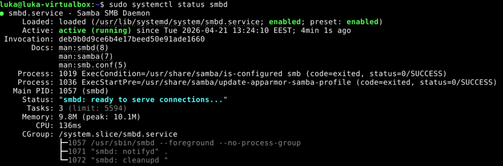

---
b) Seuraavaksi poistin samban ja smbclientin komenolla **sudo apt purge smbclien ja samba**.

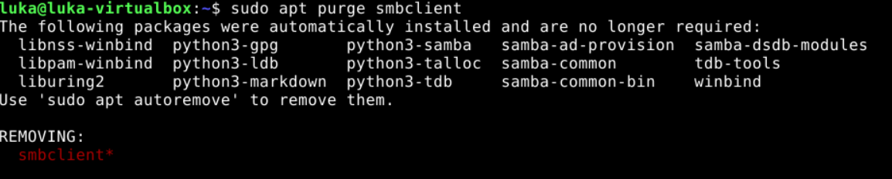
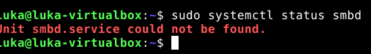

Seuraavaksi loin uuden roolin samba ansiblea varten.

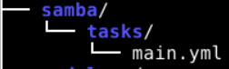

**/tasks/main.yml** sisältö. Tämä koodi asentaa sovelluksen samba ja smb viimeisimmät versiot. Ja varmistaa että smbd demoni on käynnistynyt.

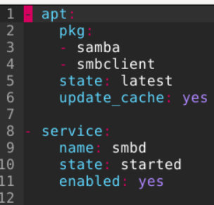

Suoritus sujui hyvin.

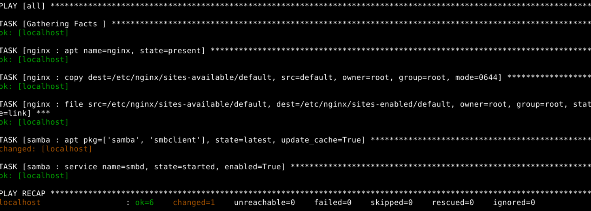
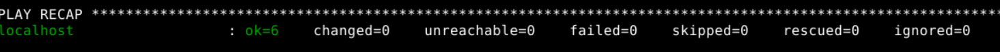

smb ja demoni asentui ja käynnistyi onnistuneesti.

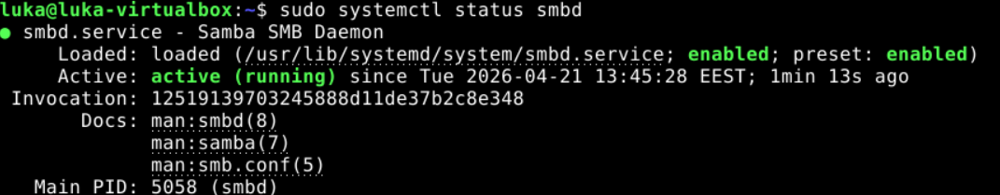

---
c) Seuraavaksi loin lisää tehtäviä samba roolin alle jotta voin korvata nykyisen conf tiedoston. 
Lisäsin oman conf tiedostoni samba/files/. 

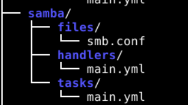

Minun luomassa conf tiedostossa ei ole paljoa muuta eroa kuin kommentti missä lukee **# KORVAAVA TIEDOSTO**. 

**handlers/main.yml** sisällä on käsky mikä käynnistää demonin uudelleen jos sitä kutsutaan **tasks/main.yml:stä.**

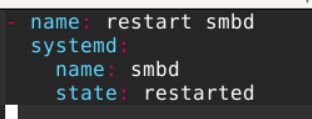

Lisäsin tasks/main.yml koodiin kohdan **(copy)** mikä kopioi conf tiedoston päälle minun oman version jos ne eivät ole samanlaiset. Jos tiedosto korvataan se ilmoittaa handlerille.

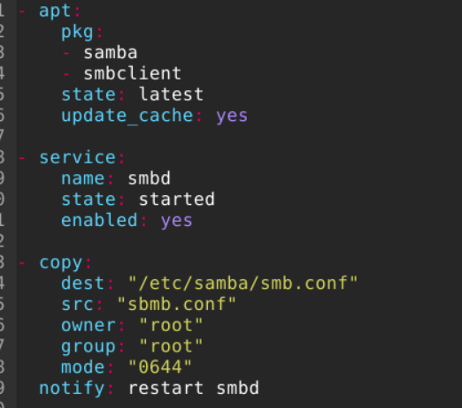

Ajoin koodin ja ekalla kerralla tuli virhe koska kuten ylemmässä kuvassa lukee src: “sbmb.conf” pitäisi olla smb.conf. 
Tämän pienen virheen korjattua kokeilin uudelleen ja kaikki meni läpi. Myöhemmillä suoritus kerroilla mitään ei tapahtunut niinkuin ei pitäisikään.

Kävin katsomassa smb.conf tiedoston ja se oli korvattu minun versiolla eli missä luki  **# KORVAAVA TIEDOSTO**
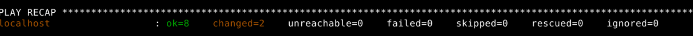

---
d & e) Tämän kohdan aloitin poistamalla kaikki demonit ja jäljelle jääneen conf tiedoston sisällön.

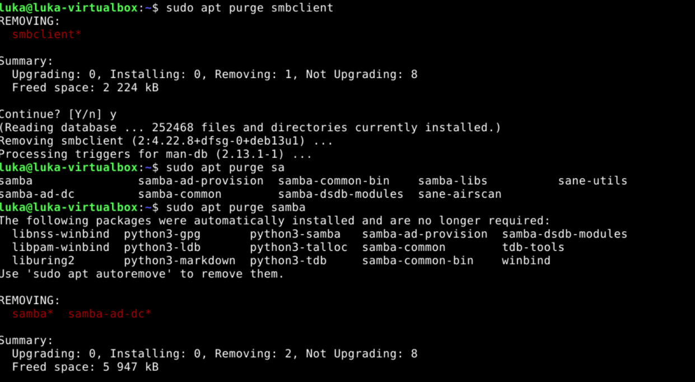
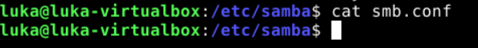

Suoritin playbookin kaikki asentui takas ja conf tiedosto korvattiin onnistuneesti. Suoritin playbookin vielä monta kertaa tämän jälkeen ja mikään ei muuttunut **(Idempotentti)**.

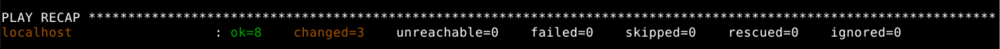
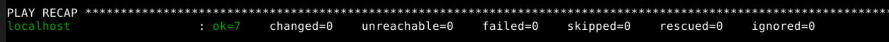
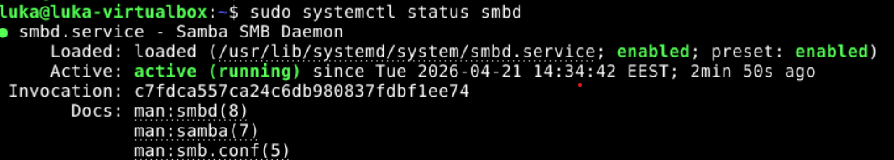

---
## Lähteet
Karvinen, Tero 2024. Configuration Management of Distributed Systems over Unreliable and Hostile Networks. Luettavissa:https://doi.org/10.34737/w7vvz Luettu: 12.4.2026
