# h5 Gitar Hero

## Tiivistykset

### What is Git?

Git toimii snapshotteina

Tiedostot kulkevat tilojen läpi **modified → staged → committed**

Suurin osa operaatioista tapahtuu paikallisesti ja pull/push hoitaa verkon yli synkronoinnin

Commit on pysyvä tallennus Gitin tietokantaan

---
### Gitin käyttö
**git add --all:** Lisää kaikki muutokset (**uudet, muokatut ja poistetut tiedostot**) staging alueelle.

**git commit:** Tallentaa staging alueen sisällön uutena snapshotina

**git pull:** Hakee muutokset palvelimelta ja tuo ne haluttuun paikkaan

**git push:** Lähettää omat commitit palvelimelle esim. Github

---
## Tehtävät

### a) 
Aloitin tehtävän tekemällä uuden varaston githubissa.

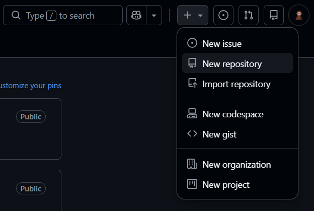

Annoin uuden varaston nimeksi gitarHero ja laitoin sen kuvaukseen sanan sunshine. Lisäksi asetin täpän päälle missä varaston luonnin yhteydessä sinne lisätään REDME tiedosto. Varaston lisenssiksi asetin GNU lisenssin.

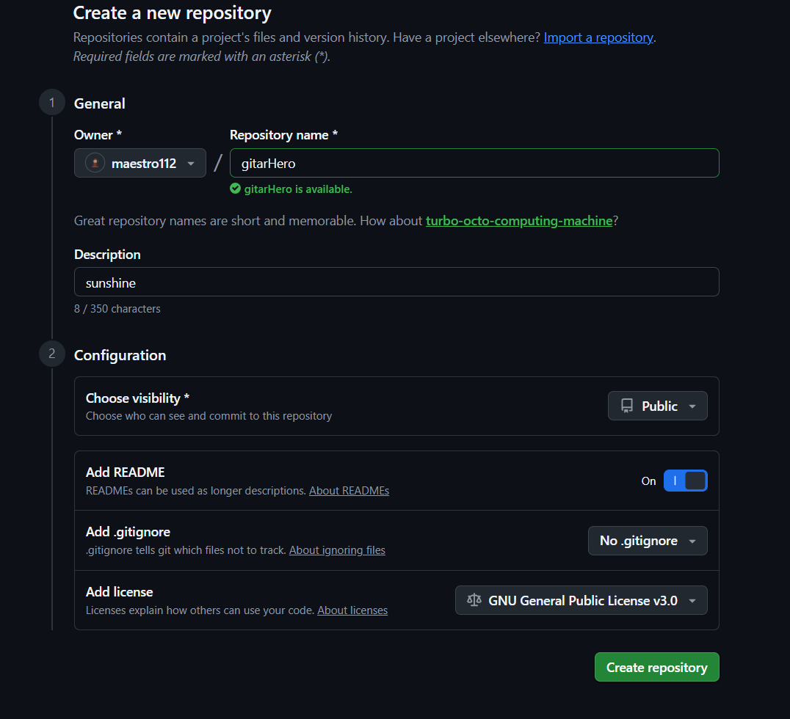

Seuraavaksi kävin kopioimassa ssh julkisen avaimen. 

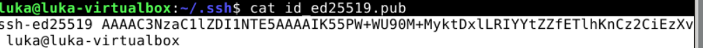

Koska virtuaalikoneen julkinen avain oli jo lisätty minun githubiin niin en voi lisätä sitä enään toista kertaa. Alla olevassa kuvassa näkyy kuitenkin miten sen tekisin eli **settings → Deploy keys**. Julkinen avain menee key kohtaan ja allow write access jos haluat työntää koneelta palvelimelle.

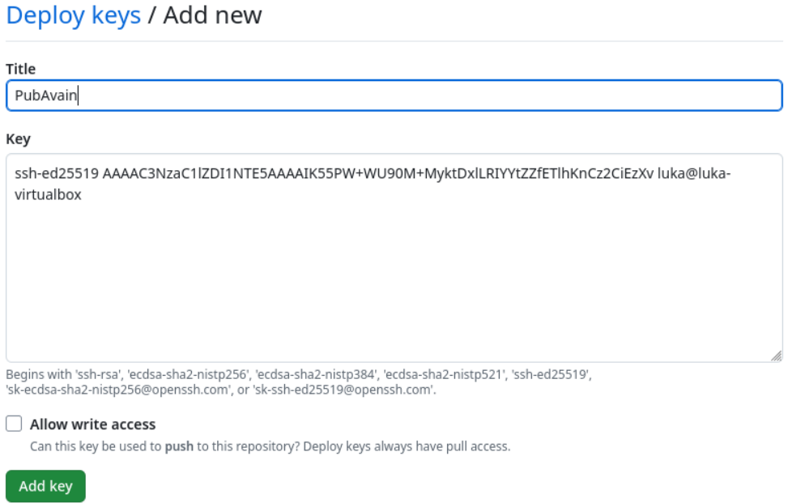

---
### b
Seuraavaksi kävin kopioimassa varaston ssh avaimen.

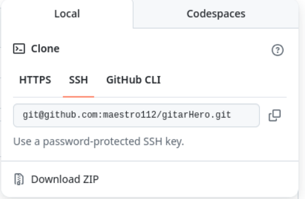

Tämän jälkeen menin koneelle ja kopioin varaston komennolla git clone.

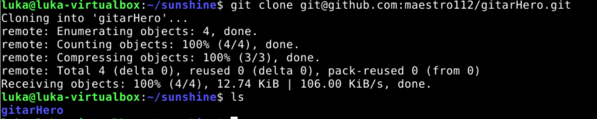

Seuraavaksi loin varastoon tiedoston **sunshine.txt**. ja työnsin sen palvelimelle komennoilla** git add -–all, git commit ja git push**.

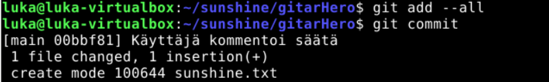

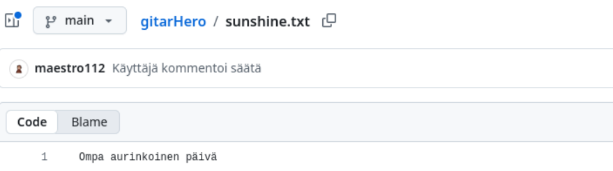

---
### c
Tässä kokeilin **git reset –-hard** komentoa. Kirjoitin jotain siansaksaa ja tallensin sen tiedostoon. **Git reset --hard** vaihtoi näköjään tiedoston sisällön takaisin viimeisimmän commitin sisältöön.  

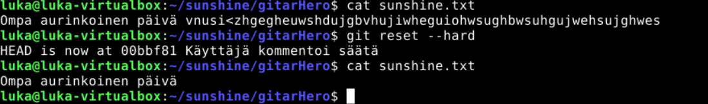

---
### d
Tässä tarkastelin git logia komennolla git log –patch. Sähköposti ja nimi näkyvät oikein. Kuvassa näkyy myös lisäämäni tiedoston tiedot ja kommentit. 

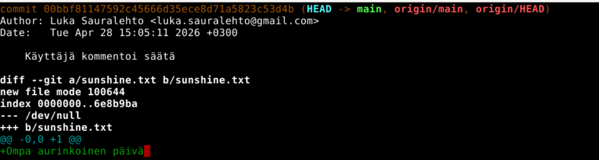

---
### e 
Seuraavaksi loin ansible kansioon uuden roolin ja tehtävän.

Lisäsin tasks hakemistoon main.yml tiedoston minkä sisältö näkyy kuvassa.

Koodin toiminnot:

**name:** pull Git vain kuvaus tehtävälle

**git:** kertoo että käytetään Ansible git moduulia

**repo:** mistä Git repositoriosta haetaan

**dest:** mihin hakemistoon kloonataan palvelimella

**version:** mikä haara (branch) haetaan tässä tilanteessa main

**update:** jos repo on jo olemassa, se päivitetään (git pull)

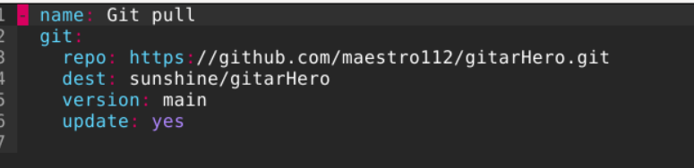

Komento suoriutui ilman ongelmia. 

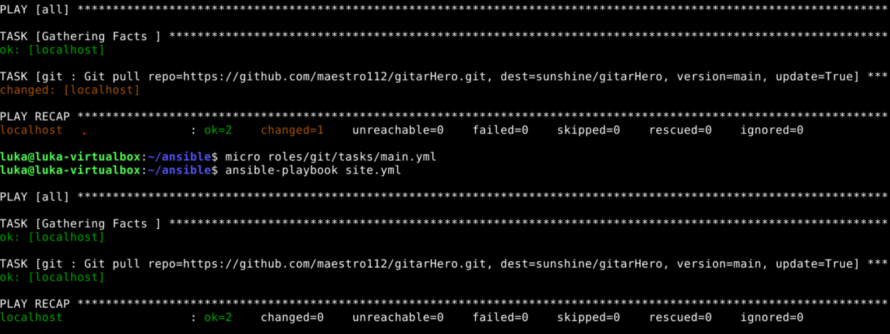

Testi mielessä kokeilin vielä luomalla uuden tiedoston webissä ja sitten suorittamalla ansible playbookin. Tiedosto vedettiin onnistuneesti koneelle oikeaan paikkaan.

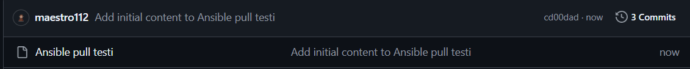

---
### f
pari hankittu

---
## Lähteet 

1.3 Getting Started - What is Git? Luettavissa:https://git-scm.com/book/en/v2/Getting-Started-What-is-Git%3F Luettu: 27.4.2026

git-add Luettavissa:https://git-scm.com/docs/git-add Luettu: 27.4.2026

git-commit Luettavissa:https://git-scm.com/docs/git-commit Luettu: 27.4.2026

git-pull Luettavissa:https://git-scm.com/docs/git-pull Luettu: 27.4.2026 

git-push Luettavissa:https://git-scm.com/docs/git-push Luettu: 27.4.2026 

d kohdassa käytetty AI apuna.

